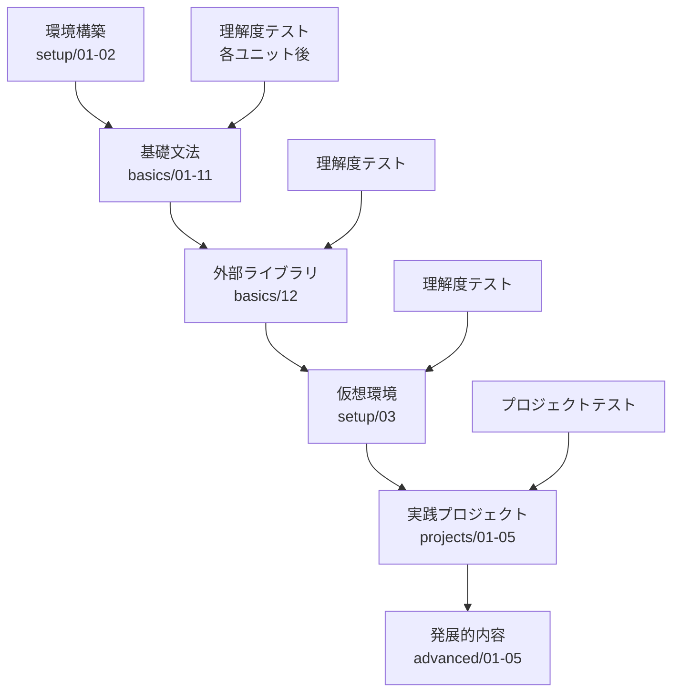

# Python完全初心者向けチュートリアル 設計書

## 📋 プロジェクト概要

### 目的
- プログラミング完全初心者がPythonを体系的に学習できるチュートリアルリポジトリの構築
- 各学習ユニット終了時の理解度テストによる学習効果の最大化
- 挫折しない学習フローの提供

### 対象者
- プログラミング未経験の完全初心者
- Python公式ドキュメントに移行できるレベルまでの基礎習得を目指す学習者

### 学習方式
- ノートブックではなく、個別Pythonファイルの実行形式
- 段階的な理解度テストによる確実な習得
- 実践的なプロジェクト開発による応用力育成

## 🏗️ リポジトリ構成

```
python-tutorial/
├── README.md                        # 初心者向け使用方法ガイド
├── DESIGN.md                        # 本設計書
├── requirements.txt                 # 基本パッケージ一覧
├── .gitignore                      # Git除外設定
├── setup/                          # 環境構築ガイド
│   ├── README.md                   # 環境構築手順
│   ├── 01_python_installation.py  # Python導入確認
│   ├── 02_environment_check.py    # 環境動作確認
│   └── 03_virtual_environment.py  # 仮想環境入門（12番後に学習）
├── basics/                         # 基礎文法学習
│   ├── README.md                   # 基礎学習ガイド
│   ├── 01_interpreter_basics.py   # インタープリター基礎
│   ├── 02_numbers_and_strings.py  # 数値と文字列
│   ├── 03_lists_and_sequences.py  # リストとシーケンス
│   ├── 04_control_flow.py         # 制御フロー
│   ├── 05_functions.py            # 関数定義と使用
│   ├── 06_data_structures.py      # データ構造
│   ├── 07_modules_and_packages.py # モジュールとパッケージ
│   ├── 08_input_output.py         # 入出力処理
│   ├── 09_errors_and_exceptions.py # エラーと例外処理
│   ├── 10_classes_and_objects.py  # クラスとオブジェクト
│   ├── 11_standard_library.py     # 標準ライブラリ
│   └── 12_external_libraries.py   # 外部ライブラリ（pip導入）
├── exercises/                      # 練習問題
│   ├── README.md                   # 練習問題ガイド
│   ├── beginner_exercises/         # 初心者向け練習
│   │   ├── 01_hello_world_variations.py
│   │   ├── 02_variables_and_input.py
│   │   ├── 03_simple_calculations.py
│   │   ├── 04_basic_control_flow.py
│   │   ├── 05_lists_and_loops.py
│   │   ├── 06_simple_functions.py
│   │   └── solutions/              # 解答例
│   └── intermediate_exercises/     # 中級練習
│       ├── 01_file_handling.py
│       ├── 02_error_handling.py
│       ├── 03_class_practice.py
│       └── solutions/              # 解答例
├── projects/                       # 実践プロジェクト
│   ├── README.md                   # プロジェクトガイド
│   ├── 01_number_guessing_game/    # 数当てゲーム
│   │   ├── README.md
│   │   ├── main.py
│   │   └── game_logic.py
│   ├── 02_simple_calculator/       # 電卓アプリ
│   │   ├── README.md
│   │   ├── main.py
│   │   ├── calculator.py
│   │   └── test_calculator.py
│   ├── 03_contact_book/           # 連絡先管理
│   │   ├── README.md
│   │   ├── main.py
│   │   ├── contact_manager.py
│   │   └── file_handler.py
│   ├── 04_weather_app/            # 天気アプリ（初の外部API）
│   │   ├── README.md
│   │   ├── requirements.txt
│   │   ├── weather_client.py
│   │   ├── main.py
│   │   └── config_example.py
│   └── 05_web_scraper/            # Webスクレイパー
│       ├── README.md
│       ├── requirements.txt
│       ├── scraper.py
│       └── example_usage.py
├── quizzes/                        # 理解度テストシステム
│   ├── README.md                   # テストシステム説明
│   ├── quiz_runner.py              # テスト実行エンジン
│   ├── quiz_config.json            # 設定ファイル
│   ├── error_handler.py            # 初心者向けエラーハンドリング
│   ├── progress_tracker.py         # 進捗管理
│   ├── basics/                     # 基礎テスト
│   │   ├── quiz_01_interpreter.py
│   │   ├── quiz_02_numbers_strings.py
│   │   ├── quiz_03_lists.py
│   │   ├── ...
│   │   └── quiz_12_external_libs.py
│   ├── projects/                   # プロジェクトテスト
│   │   ├── quiz_project_01.py
│   │   ├── quiz_project_02.py
│   │   ├── ...
│   │   └── quiz_project_05.py
│   └── results/                    # テスト結果保存
│       ├── progress.json           # 学習進捗
│       └── scores/                 # 個別成績
├── advanced/                       # 発展的内容
│   ├── README.md                   # 発展学習ガイド
│   ├── 01_decorators.py           # デコレーター
│   ├── 02_context_managers.py     # コンテキストマネージャー
│   ├── 03_generators.py           # ジェネレーター
│   ├── 04_metaclasses.py          # メタクラス
│   └── 05_async_programming.py    # 非同期プログラミング
└── utils/                          # 補助ツール
    ├── README.md                   # ユーティリティ説明
    ├── test_runner.py              # 一括テスト実行
    ├── project_generator.py        # プロジェクトテンプレート生成
    └── environment_checker.py      # 環境診断ツール
```

## 📚 学習フローの設計

### 段階的学習プロセス



### 各セクションの学習目標

#### setup/ - 環境構築
**目標**: Pythonが実行できる環境を整備する
- Python インストール確認
- IDE（VS Code推奨）の設定
- 基本的なコマンドライン操作
- 仮想環境の概念理解（後半で導入）

#### basics/ - 基礎文法（Python公式チュートリアル準拠）
参考：https://docs.python.org/ja/3.13/tutorial/
**目標**: Python言語の基本文法を完全習得する

1. **01_interpreter_basics.py**: Pythonインタープリターの使い方
2. **02_numbers_and_strings.py**: 数値・文字列操作
3. **03_lists_and_sequences.py**: リスト・タプル・辞書
4. **04_control_flow.py**: if文・for文・while文
5. **05_functions.py**: 関数定義・引数・戻り値
6. **06_data_structures.py**: 高度なデータ構造操作
7. **07_modules_and_packages.py**: モジュール作成・import
8. **08_input_output.py**: ファイル入出力・print関数
9. **09_errors_and_exceptions.py**: 例外処理・try-except
10. **10_classes_and_objects.py**: クラス定義・継承・ポリモーフィズム
11. **11_standard_library.py**: 標準ライブラリの活用
12. **12_external_libraries.py**: pip・外部パッケージ導入

#### projects/ - 実践プロジェクト
**目標**: 実用的なアプリケーション開発経験を積む

1. **数当てゲーム**: 基本的な入出力・制御フロー
2. **電卓アプリ**: 関数・モジュール分割・基本テスト
3. **連絡先管理**: ファイルI/O・データ永続化・CRUD操作
4. **天気アプリ**: 外部API・JSON処理・エラーハンドリング
5. **Webスクレイパー**: HTML解析・データ抽出・外部ライブラリ活用

## 🧪 理解度テストシステム設計

### テスト形式の体系

#### A. 選択肢問題（基礎理解確認）
```python
{
    "type": "multiple_choice",
    "question": "次のうち、正しいリストの定義はどれですか？",
    "code": None,
    "choices": [
        "fruits = ['apple', 'banana', 'orange']",
        "fruits = ('apple', 'banana', 'orange')",
        "fruits = {'apple', 'banana', 'orange'}",
        "fruits = {0: 'apple', 1: 'banana', 2: 'orange'}"
    ],
    "correct": 0,
    "explanation": "角括弧[]を使うとリスト、丸括弧()はタプル、波括弧{}は集合または辞書になります。",
    "difficulty": 1,
    "review_section": "03_lists_and_sequences"
}
```

#### B. コード穴埋め問題（実装理解確認）
```python
{
    "type": "fill_blank",
    "question": "リストの最後に要素を追加するコードを完成させてください",
    "code_template": "fruits = ['apple', 'banana']\nfruits.____('orange')\nprint(fruits)",
    "expected_output": "['apple', 'banana', 'orange']",
    "correct_answer": "append",
    "hints": [
        {
            "level": 1,
            "text": "リストには要素を追加する専用のメソッドがあります",
            "penalty": 0
        },
        {
            "level": 2,
            "text": "末尾に追加するメソッドは 'a' で始まります",
            "penalty": 10
        }
    ],
    "difficulty": 2,
    "review_section": "03_lists_and_sequences"
}
```

#### C. エラー修正問題（デバッグ能力確認）
```python
{
    "type": "debug",
    "question": "以下のコードにはエラーがあります。修正してください",
    "buggy_code": '''
def calculate_area(radius)
    area = 3.14 * radius * radius
    return area

result = calculate_area(5)
print(result)
''',
    "error_type": "SyntaxError",
    "correct_code": '''
def calculate_area(radius):
    area = 3.14 * radius * radius
    return area

result = calculate_area(5)
print(result)
''',
    "explanation": "関数定義の後には必ずコロン(:)が必要です",
    "common_mistakes": ["コロン忘れ", "インデント間違い"],
    "difficulty": 2,
    "review_section": "05_functions"
}
```

#### D. 実行結果予測問題（動作理解確認）
```python
{
    "type": "predict_output",
    "question": "以下のコードの実行結果を予測してください",
    "code": '''
numbers = [1, 2, 3, 4, 5]
result = []
for num in numbers:
    if num % 2 == 0:
        result.append(num * 2)
print(result)
''',
    "choices": [
        "[2, 4, 6, 8, 10]",
        "[4, 8]",
        "[1, 4, 3, 8, 5]",
        "[]"
    ],
    "correct": 1,
    "explanation": "偶数(2, 4)のみが条件に合致し、それぞれ2倍されて[4, 8]となります",
    "difficulty": 3,
    "review_section": "04_control_flow"
}
```

#### E. 実装問題（応用力確認）
```python
{
    "type": "implementation",
    "question": "偶数のみを返す関数を実装してください",
    "requirements": [
        "関数名: get_even_numbers",
        "引数: numbers (リスト)",
        "戻り値: 偶数のみのリスト"
    ],
    "test_cases": [
        {"input": [1, 2, 3, 4, 5, 6], "expected": [2, 4, 6]},
        {"input": [1, 3, 5], "expected": []},
        {"input": [], "expected": []}
    ],
    "template": "def get_even_numbers(numbers):\n    # ここに実装してください\n    pass",
    "hints": [
        {
            "level": 1,
            "text": "for文でリストの各要素を処理します",
            "penalty": 0
        },
        {
            "level": 2,
            "text": "% 演算子で偶数判定ができます",
            "penalty": 15
        },
        {
            "level": 3,
            "text": "number % 2 == 0 で偶数かどうかわかります",
            "penalty": 25
        }
    ],
    "difficulty": 3,
    "review_section": "04_control_flow"
}
```

### テスト配分と難易度設計

#### 基礎ファイル（01-11）: 6-8問構成
- **理解確認** (40%): 選択肢問題・穴埋め問題
- **応用確認** (30%): 実行結果予測・エラー修正
- **実装確認** (30%): 簡単な実装問題

#### 外部ライブラリ（12）: 8-10問構成
- **概念理解** (50%): pip使用法・仮想環境の必要性
- **実践応用** (50%): 実際のライブラリ使用・トラブルシューティング

#### プロジェクト: コードレビュー形式
- **設計理解**: プロジェクトの構造と役割分担
- **機能拡張**: 既存コードに新機能を追加
- **バグ修正**: 意図的に仕込まれたバグの発見と修正

### 合格基準

```json
{
    "pass_criteria": {
        "basics": {
            "minimum_score": 70,
            "required_categories": ["理解確認", "応用確認", "実装確認"],
            "retry_limit": 3,
            "cooling_period": "1時間"
        },
        "projects": {
            "minimum_score": 75,
            "code_review_passed": true,
            "practical_demonstration": true
        }
    }
}
```

## 🎯 初心者向けガイダンスシステム

### 学習完了時の自動ガイダンス

```python
def show_completion_message(file_number, next_file=None):
    """各学習ファイル終了時の標準メッセージ"""
    print("\n" + "🎉" * 20)
    print(f"   ファイル {file_number:02d} の学習完了！   ")
    print("🎉" * 20)

    print(f"\n📚 理解度テストを受けましょう")
    print("以下のコマンドをコピー&ペーストして実行してください:\n")

    # OS別コマンド表示
    import platform
    python_cmd = "py" if platform.system() == "Windows" else "python3"
    print(f"   {python_cmd} quizzes/quiz_runner.py basics {file_number:02d}")

    print(f"\n✅ テスト合格後、次に進みましょう:")
    if next_file:
        print(f"   {python_cmd} basics/{next_file}")
    else:
        print("   おめでとうございます！基礎学習が完了しました！")

    print("\n💡 困ったときは:")
    print(f"   {python_cmd} quizzes/quiz_runner.py help")
    print("=" * 50)
```

### エラーハンドリングとトラブルシューティング

```python
class BeginnerErrorHandler:
    """完全初心者向けエラー対応システム"""

    def handle_command_not_found(self):
        print("🚨 'python3' コマンドが見つかりません")
        print("\n🔧 解決方法:")
        print("1. Windowsの場合: 'py' を試してください")
        print("   py quizzes/quiz_runner.py basics 01")
        print("2. Macの場合: 'python' を試してください")
        print("   python quizzes/quiz_runner.py basics 01")

    def handle_file_not_found(self):
        print("🚨 ファイルが見つかりません")
        print("\n🔧 解決方法:")
        print("1. 正しいフォルダにいるか確認:")
        print("   ls (Mac/Linux) または dir (Windows)")
        print("   → 'quizzes' フォルダが見えるはずです")
        print("2. python-tutorial フォルダに移動:")
        print("   cd python-tutorial")

    def run_environment_diagnosis(self):
        """自動環境診断"""
        checks = [
            ("Python インストール", self._check_python),
            ("作業ディレクトリ", self._check_directory),
            ("必要ファイル", self._check_files),
            ("実行権限", self._check_permissions)
        ]

        print("🔍 環境診断を実行中...")
        for name, check_func in checks:
            try:
                result = check_func()
                status = "✅" if result else "❌"
                print(f"{status} {name}")
            except Exception as e:
                print(f"❌ {name}: {e}")
```

### 進捗管理システム

```python
class ProgressTracker:
    """学習進捗の追跡と可視化"""

    def show_dashboard(self):
        """初心者向け進捗ダッシュボード"""
        print("📈 あなたの学習進捗")
        print("=" * 50)

        # 基礎セクション進捗
        print("🔤 基礎セクション (1-12):")
        for i in range(1, 13):
            status = self.get_completion_status("basics", i)
            icon = "✅" if status["completed"] else "⏳"
            score = f"({status['best_score']}%)" if status["best_score"] else ""
            print(f"   {icon} {i:02d}: {self._get_section_name(i)} {score}")

        # プロジェクト進捗
        print("\n🛠️ プロジェクトセクション:")
        projects = ["数当てゲーム", "電卓", "連絡先管理", "天気アプリ", "Webスクレイパー"]
        for i, name in enumerate(projects, 1):
            status = self.get_completion_status("project", i)
            icon = "✅" if status["completed"] else "⏳"
            print(f"   {icon} {i}: {name}")

        # 次のアクション提案
        next_action = self.suggest_next_action()
        print(f"\n💡 次にやること: {next_action}")
```

## 📊 テスト実行システムの仕様

### quiz_runner.py の基本仕様

```python
class QuizRunner:
    """理解度テスト実行エンジン"""

    def __init__(self):
        self.config = self.load_config()
        self.error_handler = BeginnerErrorHandler()
        self.progress_tracker = ProgressTracker()

    def main(self):
        """メイン実行関数"""
        try:
            args = self.parse_arguments()

            if args.command == "help":
                self.show_help(args.level)
            elif args.command == "progress":
                self.progress_tracker.show_dashboard()
            elif args.command == "diagnose":
                self.error_handler.run_environment_diagnosis()
            else:
                self.run_quiz(args.section, args.number)

        except Exception as e:
            self.handle_error(e)

    def run_quiz(self, section, number):
        """クイズ実行"""
        print("🧪 理解度テストを開始します")
        print("=" * 40)
        print("📋 テストについて:")
        print("  • 問題数: 6-8問")
        print("  • 合格ライン: 70%")
        print("  • 再挑戦: 3回まで可能")
        print("  • ヒント: 利用可能（得点は少し下がります）")

        if not self.confirm_start():
            return

        quiz_data = self.load_quiz_data(section, number)
        score = self.execute_quiz(quiz_data)
        self.show_results(score, section, number)
```

### 実行コマンド仕様

```bash
# 基本的なテスト実行
python3 quizzes/quiz_runner.py basics 01    # 基礎01テスト
python3 quizzes/quiz_runner.py project 01   # プロジェクト01テスト

# 進捗・ヘルプ系
python3 quizzes/quiz_runner.py progress     # 進捗確認
python3 quizzes/quiz_runner.py help         # 基本ヘルプ
python3 quizzes/quiz_runner.py help detailed # 詳細ヘルプ
python3 quizzes/quiz_runner.py diagnose     # 環境診断

# エラー時の復旧
python3 quizzes/quiz_runner.py help trouble # トラブルシューティング
```

## 🎨 ユーザーエクスペリエンス設計

### 学習フローの可視化

```
📚 学習開始
    ↓
🔧 環境構築 (setup/01-02)
    ↓
📖 基礎学習 (basics/01-11)
    ↓ (各ファイル後)
🧪 理解度テスト
    ↓ (合格後)
📦 外部ライブラリ (basics/12)
    ↓
🌐 仮想環境 (setup/03)
    ↓
🛠️ 実践プロジェクト (projects/01-05)
    ↓
🚀 発展的内容 (advanced/01-05)
```

### モチベーション維持の仕組み

1. **即座のフィードバック**: テスト結果と改善点の明示
2. **進捗の可視化**: 達成度をグラフィカルに表示
3. **段階的達成感**: 小さな成功体験の積み重ね
4. **個別最適化**: 弱点に応じた復習提案

### エラー防止機能

1. **事前チェック**: 環境診断による問題の早期発見
2. **段階的ヒント**: 詰まった時の適切なサポート
3. **自動復旧**: よくあるエラーの自動解決提案
4. **フォールバック**: 複数の解決手段の提示

## 🔧 実装優先順位

### フェーズ1: 基盤構築
1. リポジトリ構造の作成
2. 基本的なsetup/ファイル作成
3. basics/01-03の基礎ファイル作成
4. 基本的なquiz_runner.py実装

### フェーズ2: テストシステム
1. 選択肢問題・穴埋め問題の実装
2. 自動採点システム
3. 基本的な進捗管理
4. エラーハンドリング機能

### フェーズ3: 完全な基礎セクション
1. basics/04-12の全ファイル作成
2. 対応する理解度テスト作成
3. 学習ガイダンスシステム完成
4. 初心者向けサポート機能充実

### フェーズ4: プロジェクトセクション
1. 5つの実践プロジェクト作成
2. プロジェクト用テストシステム
3. 仮想環境導入ガイド
4. 総合的な学習管理システム

### フェーズ5: 発展機能
1. advanced/セクション作成
2. 学習分析・推奨システム
3. コミュニティ機能（将来拡張）
4. 継続学習サポート機能

## 📈 期待される学習効果

### 定量的目標
- 学習完了率: 80%以上
- 各テスト合格率: 初回70%以上
- プロジェクト完成率: 90%以上
- 学習継続率（1ヶ月後）: 60%以上

### 定性的目標
- Python公式ドキュメントを読める
- 簡単なアプリケーションを自力で作成できる
- エラーメッセージを理解して自力でデバッグできる
- 外部ライブラリを活用したプロジェクトを作成できる

---

**設計書バージョン**: 1.0
**最終更新**: 2025年6月8日
**担当**: Python Tutorial Development Team
